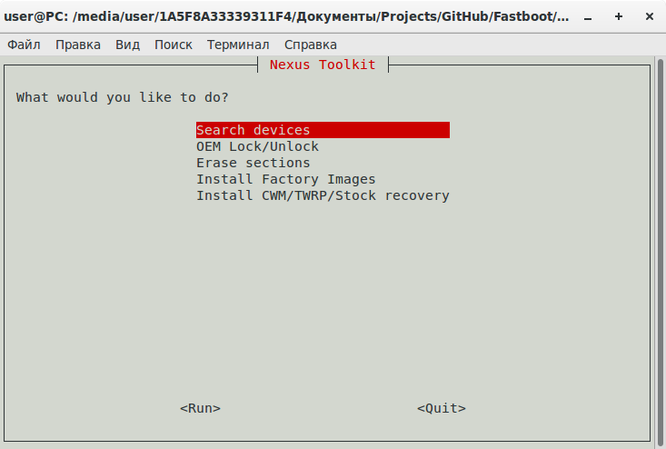
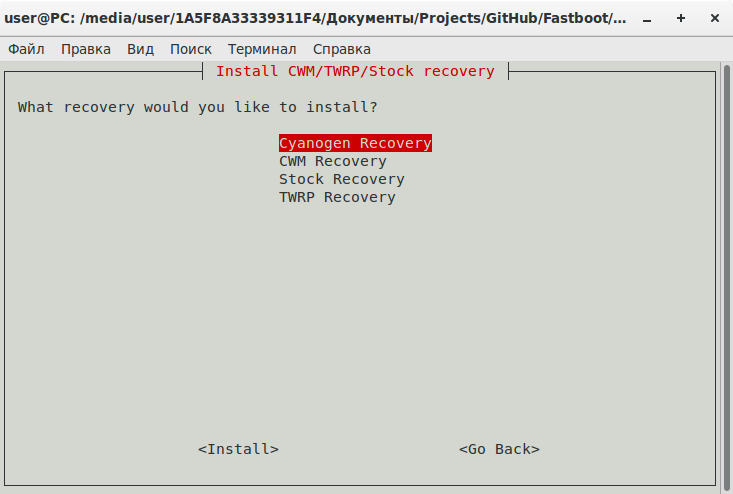
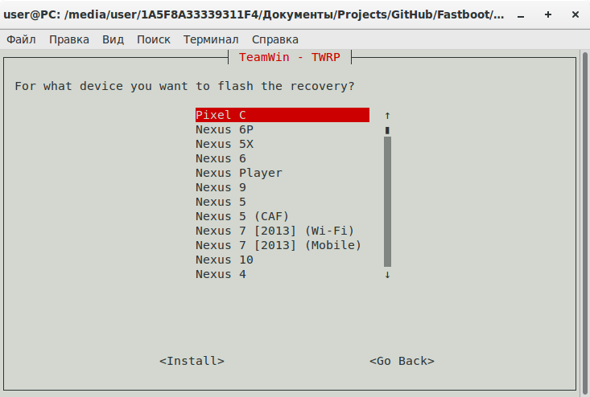
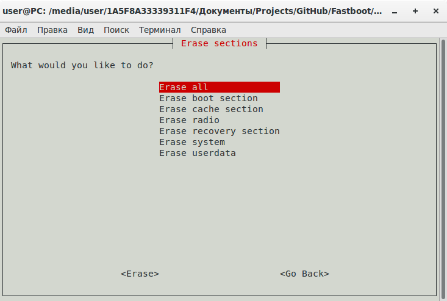
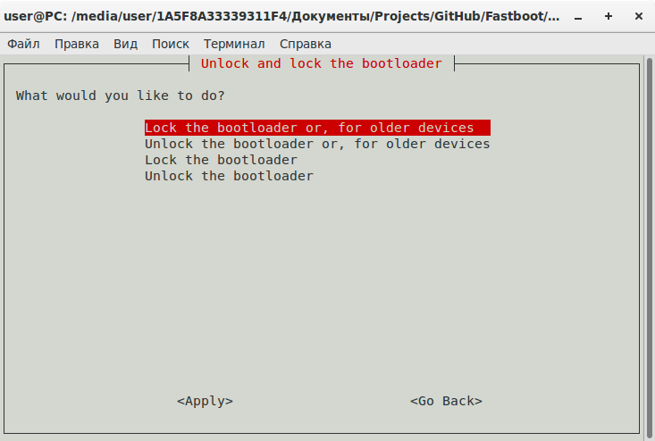

# Nexus Toolkit Script
Android Toolkit for Arch Linux (Manjaro, VeltOS), Debian (Knoppix, Ubuntu, Elementary OS, Tails, LinuxMint), Red Hat (Fedora, CentOS, openSUSE)

This page contains a tool binary image files that allow you to restore your Nexus device's original factory firmware. These binary image files are written for your convenience, for example, if you are a tester and custom firmware you have to often return the phone to its original state.

And also, this tool allows you to set custom recovery, lock/unlock bootloader and erasing partitions.

## Features
- Automatically installs the necessary software (Fastboot/ADB)
- Automatically downloads the required recovery (Cyanogen Recovery/[CWM](https://www.clockworkmod.com/rommanager)/[TWRP](https://twrp.me/)/[Stock](https://developers.google.com/android/nexus/images))
- Automatically downloads the [original](https://developers.google.com/android/nexus/images) firmware image for your devices

## Flashing Instructions
 - Download the script

Run in the console:

    git clone https://github.com/igor-dyatlov/nexus-toolkit-script.git

 Alternatively you can [download](https://github.com/igor-dyatlov/nexus-toolkit-script/archive/master.zip) this repository.

 - Connect your device to your computer over USB

Run from source folder:

    ./start.sh

On your device, go into Settings -> About and find the Build Number and tap on it 7 times to enable developer settings. Press back and go into Developer Options and enable USB debugging. From your computer, open a command prompt and type:

Excellent! Good luck in the firmware    

## Screenshots

### Donation
https://www.paypal.me/IgorDyatlov

### License
All files in this project are under the [LICENSE.md](LICENSE.md) license unless otherwise stated in the file or by a dependency's license file.
